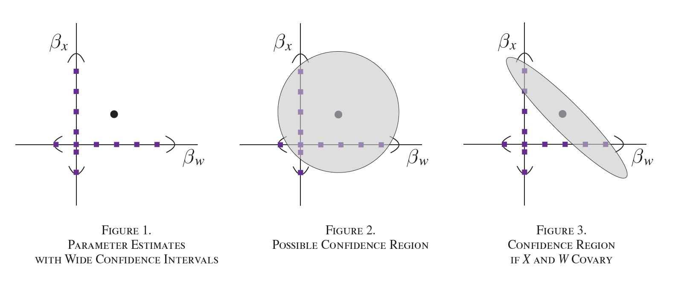
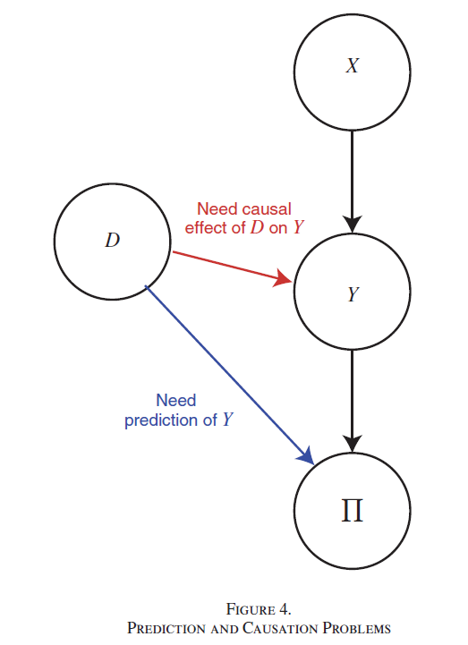

# Predicción y causalidad

## Preguntas estadísticas vs preguntas causales

La estadística está orientada a la descripción de un sistema o predecir una observación. En la inferencia causal la pregunta tiene que ver con el efecto de algún tipo de intervención. 

 

**Preguntas predictivas**

::: {.fragment}
- ¿Está esta firma en riesgo de quiebra?
- ¿Es este individuo elegible para el subsidio?
:::

**Preguntas causales**

::: {.fragment}
- ¿Un incremento en la tarifa de imporenta incrementa el riesgo de quiebra?
- ¿El subsidio de desempleo incrementa el tiempo de duración en desempleo?
:::

## Predicción versus estimación

Considere el siguiente modelo de regresión

$$
Y=\beta_X X+\beta_W W+\epsilon
$$

Al estimar obtenemos $\hat\beta_X$ y $\hat\beta_W$, así como $se(\hat\beta_X)$ y $se(\hat\beta_W)$.

::: {.callout-note title="Pregunta" .fragment}
Supongamos que los $se(\cdot)$ son tales que los coeficientes no son significativos. ¿Quiere decir esto que las variables $X$ y $W$ no sirven para predecir $Y$?
:::

## {.center}

{fig-align="center" width="95%"}

::: {.fuente}
Fuente: @mullainathan2025.
:::

## Dos objetivos distintos

:::: {.columns}
::: {.column width="50%"}
::: {.tarjeta .acento}
[Predicción]{.tarjeta-titulo}

Nos interesa $\hat Y$ en relación con $Y$.

Es el dominio del *machine learning*.
:::
:::
::: {.column width="50%"}
::: {.tarjeta}
[Estimación]{.tarjeta-titulo}

Nos interesa $\hat\beta$.

Es el dominio de la econometría.
:::
:::
::::

::: {.fragment}
- ¿Cuándo un problema es de predicción y cuándo de estimación?
- ¿Puede el ML apoyar en problemas de estimación? **Sí.**
:::

# Predicción y causalidad

## Dos decisiones bajo incertidumbre

Considere los siguientes ejemplos [@kleinberg2015]:

:::: {.columns}
::: {.column width="50%"}
::: {.tarjeta}
[Baile para la lluvia]{.tarjeta-titulo}

Ante la amenaza de una sequía se debe decidir si se invierte en un baile para la lluvia, a fin de aumentar la probabilidad de lluvia.

[Causalidad]{.respuesta .fragment fragment-index=1}
:::
:::
::: {.column width="50%"}
::: {.tarjeta}
[Sombrilla]{.tarjeta-titulo}

Al observar nubes en el cielo se debe decidir si llevar la sombrilla para no mojarse en el camino al trabajo.

[Predicción]{.respuesta .fragment fragment-index=1}
:::
:::
::::

::: {.callout-note title="Pregunta"}
¿Cuál es un problema de predicción y cuál de causalidad?
:::

## Predicción y causalidad

Sea $Y$ una variable de resultado que depende de una manera desconocida de la variable $X_0$. El tomador de decisión debe elegir $X_0$ con el propósito de maximizar una función de pago $\pi(X_0,Y)$. La decisión depende de

$$
\frac{d\pi(X_0,Y)}{dX_0}=
\underbrace{\frac{\partial\pi}{\partial X_0}(Y)}_{\text{predicción}}
+\frac{\partial \pi}{\partial Y}\,
\underbrace{\frac{\partial Y}{\partial X_0}}_{\text{causalidad}}
$$

## De vuelta a los ejemplos

- **Baile para la lluvia:** causalidad, porque no tiene efecto directo en el pago: $\frac{\partial \pi}{\partial X_0}=0$.
- **Sombrilla:** predicción, pues esta no tiene ningún efecto sobre la lluvia: $\frac{\partial Y}{\partial X_0}=0$.

::: {.fragment}
En el segundo caso, el valor de la acción depende del valor de $Y$. Requiere **bajo error de predicción**.
:::

## Las decisiones del juez

:::: {.columns}
::: {.column width="58%"}
@mullainathan2025 presenta los siguientes casos:

- En una audiencia previa, el juez debe decidir si el acusado debe ser privado o no de la libertad antes del juicio. Existe el riesgo de que escape o reincida si es dejado libre.
- El juez debe decidir si le coloca el brazalete electrónico al acusado.

::: {.callout-note title="Pregunta"}
¿La decisión del juez afecta la probabilidad de escape o reincidencia?
:::
:::
::: {.column width="42%"}
{fig-align="center" height="560"}
:::
::::

## ML para inferencia causal

Necesita computar el efecto de la intervención $d$ sobre $Y(d)$

$$
Y(d)=\alpha d+U
$$

donde $\alpha$ es el parámetro causal: el cambio en $Y$ cuando cambia $d$, manteniendo todo lo demás constante. Si $d$ está relacionado con $U$ no podrá recuperar $\alpha$. Si observa el conjunto de variables, confounders, $W$, entonces

$$
Y=\alpha D+g(W)+\epsilon; \quad E[\epsilon|D,W]=0
$$

Si $W$ es pequeño y el modelo lineal, la econometría clásica funciona. Pero, si $W$ es grande y la función de predicción $g(W)$ es no lineal, mejor ML

# Sesgo y varianza

## El problema de predicción

Tenemos un conjunto de datos $D$ con $n$ observaciones $(y_i,x_i)\sim G$. Usamos estos datos para escoger una función $\hat{f}\in F$ que prediga $y$ en un nuevo conjunto de datos, minimizando una función de pérdida: el MSE (*mean squared error*). Para un nuevo punto $x$,

$$
MSE(x)=E_D\big[(\hat{f}(x)-y)^2\big]
$$

Es decir, la media de la diferencia al cuadrado entre el valor predicho $\hat{y}=\hat{f}(x)$ dado ese nuevo valor de $x$ y el valor observado de $y$.

## Descomposición del MSE

Si $y=f(x)+\epsilon$, donde $\epsilon\sim (0,\sigma^2)$, entonces

$$
MSE(x)=E_D\big[(\hat{f}(x)-(f(x)+\epsilon))^2\big]
$$

de donde se puede mostrar que

$$
MSE(x)=
\underbrace{E_D\big[(\hat{f}(x)-E_D\hat{f}(x))^2\big]}_{\text{varianza}}
+\underbrace{\big(E_D\hat{f}(x)-f(x)\big)^2}_{\text{sesgo}^2}
+\underbrace{\sigma^2}_{\text{irreducible}}
$$

::: {.incremental}
- **Varianza:** cuánto varía la función de predicción de muestra a muestra.
- **Sesgo²:** distancia entre la predicción promedio y la función verdadera.
- **Error irreducible:** no depende del modelo.
:::

## Complejidad del modelo y MCO

En la medida en que el modelo es más complejo, la varianza tiende a aumentar y el sesgo a reducirse.

Si la función de predicción es MCO,

$$
\hat{f}_{MCO}=\underset{\beta}{\mathrm{argmin}}\ \frac{1}{n}\sum_{i=1}^n \big(y_i-(\alpha+\beta x_i)\big)^2
$$

entonces el término de sesgo es cero, pero la varianza es alta.

::: {.callout-important title="Idea clave"}
MCO minimiza el error de predicción **dentro de muestra**, pero nos interesa el desempeño **fuera de muestra**.
:::

## Regularización

Los algoritmos de ML se han diseñado para mejorar el desempeño predictivo teniendo en cuenta el *trade-off* entre sesgo y varianza. ML minimiza

$$
\hat{f}_{ML}=\underset{f\in F}{\mathrm{argmin}}\ \frac{1}{n}\sum_{i=1}^n \big(y_i-f(x_i)\big)^2+\lambda R(f)
$$

donde $R(f)$ es un **regularizador** que penaliza las funciones que crean varianza.

## Referencias

::: {#refs}
:::
