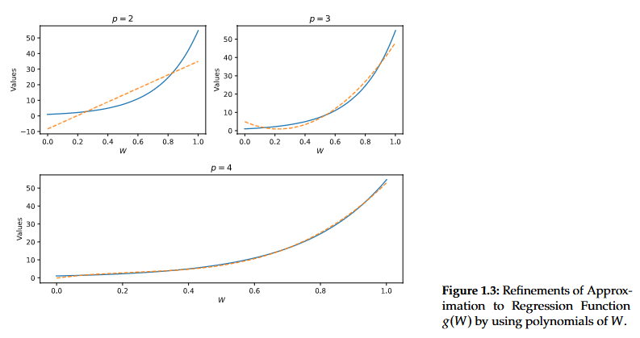
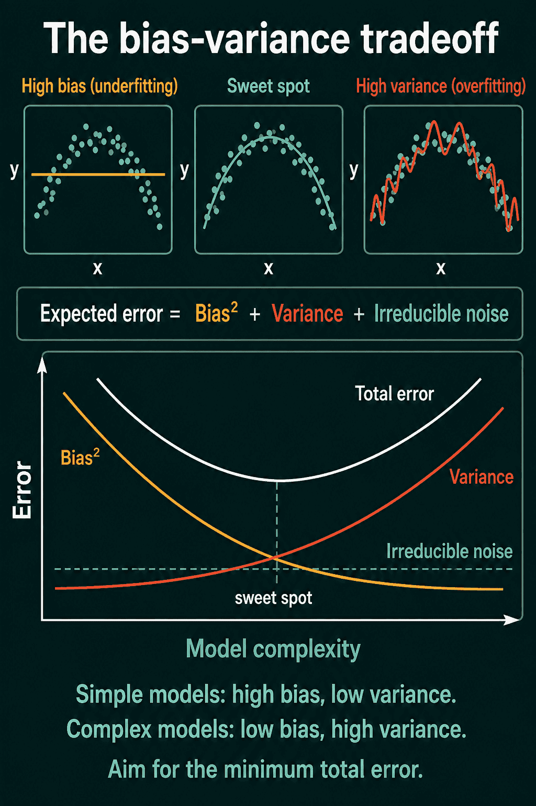

# Regresión lineal

## El mejor predictor lineal

Sea $Y$ una variable aleatoria y el vector de covariables $X=(X_1,X_2,...,X_p)´$, con $X_1=1$. Queremos la mejor regla de predicción lineal de $Y$ usando $X$

$$
\sum_{j=1}^p\beta_jX_j; \quad \text{para}\quad \beta=(\beta_1,...,\beta_p)'
$$

Definimos $\beta$ como cualquier solución al problema del mejor predictor lineal (BLP)

$$
\underset{\beta\in R^p}{\text{min}}E\Big[(Y-\beta'X)^2\Big]
$$

Es decir, minimizar el error cuadrático medio, MSE

## El mejor predictor lineal

El análogo muestral del BLP es el estimador MCO

$$
\hat{\beta}=\underset{\beta\in R^p}{\text{min}}\dfrac{1}{n}\sum_{i=1}^n\Big(Y_i-\beta_i'X_i\Big)^2
$$

Al resolver, obtenemos

$$
\hat{\beta}=\Big(\sum_iX_i'X_i\Big)^{-1}\Big(\sum_iX_i'Y_i\Big)
$$

## El mejor predictor lineal

El estimador MCO tiene propiedades deseables bajo el siguiente supuesto

**Supuesto** Considere la secuencia iid de variables aleatorias $(Y_i,X_i)_{i=1,...,n}$ tal que 
$$
Y_i=\beta'X_i+\epsilon_i
$$

donde $E[\epsilon_i|X_i]=0$, $E[X_i'X]$ existe y es no singular, y $E[||\epsilon_iX_i||_2^2]<\infty$

::: {.tarjeta .acento style="height: auto;"}
[Teorema]{.tarjeta-titulo}

Bajo el supuesto anterior
$$
\sqrt{n}(\hat\beta-\beta)\overset{d}{\rightarrow}N(0,E[X'X]^{-1}E[\epsilon^2X'X]E[X'X]^{-1}), \quad \text{cuando}\quad n\rightarrow \infty
$$
:::

El estimador es consistente

## El mejor predictor

Sabemos que MCO es también BLP. Sin embargo no todas las relaciones son lineales. Sea $W$ los regresores crudos y $X=T(W)$ los regresores transformados. Estos regresores permiten capturar patrones no lineales y mejorar la predicción. Por ejemplo, $X_1=W_1$, $X_2=W_1^2$. En la población el mejor predictor de $Y$ dado $W$ es

$$
g(W)=E(Y|W)
$$

Al usar $\beta'T(W)$ estamos aproximando $g(W)$

## El mejor predictor
Ejemplo: 

::: {.fragment}
- Suponga $U\sim U(0,1)$ y $g(W)=exp(4W)$ 
- Usamos $T(W)=(1,W,W^2,...,W^{p-1})'$
:::

{fig-align="center" width="95%"}

::: {.fuente}
Fuente: @chernozhukov2024applied.
:::

# Cuando p>n

## p, n y los límites de MCO

- Necesitamos estimar p parámetros: $\beta_1,...,\beta_p$
- Para estimar cada parámetro necesitamos observaciones
- Si p/n es pequeño, tenemos suficientes observacioens por parámetro
- El error de estimación es pequeño
- Cuando p/n es pequeño y n es grande $MSE_{sample}\approx MSE_{pop}$ y $R^2_{sample}\approx R^2_{pop}$ 

## Overfitting

¿Qué pasa si p/n no es pequeño?

:::: {.columns}
::: {.column width="50%"}

::: {.fragment}
- Pérdida de precisión por multicolinealidad
- Podría no poderse identificar el vector $\beta$
- Las medidas de ajuste dentro de muestra son engañosas. Muy buena predición dentro de muestra, pésima fuera de muestra **overfitting**
:::
:::
::: {.column width="50%"}
{fig-align="center" width="60%"}
:::

::: {.fuente}
Fuente: https://quiddityml.com/blog/bias-variance-tradeoff/ 
:::

::::

## Referencias

::: {#refs}
:::
