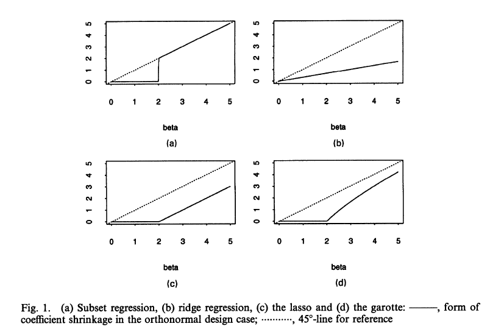

# Introducción

## Ejemplo

El MSE de un estimador escalar $\tilde{\theta}$ es

$$
\begin{aligned}
MSE(\tilde{\theta})&=E[(\tilde{\theta}-\theta)^2]\\
&=Var(\tilde\theta)+Bias^2(\tilde\theta)
\end{aligned}
$$

Suponga que el estimador escalar $\hat\theta$ es insesgado para $\theta$

$$
\begin{aligned}
&E[\hat\theta]=\theta \quad \text{y} \quad Var(\hat\theta)=v\\
&MSE(\hat\theta)=v
\end{aligned}
$$

## Ejemplo

Sea $\tilde\theta=a\hat\theta$ con $0\leq a\leq1$. Tenemos que

::: {.fragment}
- $Bias(\tilde\theta)=E[\tilde\theta]-\theta=(a-1)\theta$
- $Var(\tilde\theta)=Var(a\hat\theta)=a^2v$
- $MSE(\tilde\theta)=Var(\tilde\theta)+Bias^2(\tilde\theta)=a^2v+(a-1)^2\theta^2$
:::

::: {.fragment}
::: {.tarjeta .acento style="height: auto;"}
Luego $MSE(\tilde\theta)<MSE(\hat\theta)$ si 
$$
\theta^2<\dfrac{1+a}{1-a}v
$$
:::
:::

# Estimador LASSO

## LASSO

*Least Absolute Shrinkage and Selection Operator*, propuesto por @tibshirani1996regression. El problema es el siguiente:

Tenemos los datos $(\mathbf{x}^i,y_i)$, $i=1,\dots,n$, donde $\mathbf{x}^i=(x_{i1},x_{i2},\dots,x_{ip})^T$ son las variables predictoras y $y_i$ la respuesta. Suponemos que las observaciones son independientes y que las $x_{ij}$ están estandarizadas. Sea $\boldsymbol{\hat{\beta}}=(\hat\beta_1,\dots,\hat\beta_p)^T$; el estimador lasso se define como

$$
\min_{\beta}\sum_i\Big(y_i-\sum_j\beta_jx_{ij}\Big)^2 \quad \text{s.t.} \quad \sum_j|\beta_j|\leq t
$$

## LASSO

El problema anterior es equivalente a

$$
\min_{\beta}\sum_i\Big(y_i-\sum_j\beta_jx_{ij}\Big)^2+\lambda\sum_j|\beta_j|
$$

::: {.fragment}
- Si $\lambda>0$ obtenemos una regla de predicción menos compleja que la que se obtendría con mínimos cuadrados sin restricción
- Se hace un *trade-off* entre la predicción dentro de muestra y la complejidad
- El estimador encoge los parámetros hacia cero: hay un **shrinkage bias**
- Algunos coeficientes se hacen cero: **lasso selecciona variables**
- Esto no quiere decir que sean las correctas: puede que no sean cero en la población
:::

## LASSO

{fig-align="center" width="70%"}

Los estimadores encogen los coeficientes en relación con MCO. Lasso, además, lleva algunos a cero.

## LASSO

- Funciona mejor cuando pocos regresores tienen $\beta_j\neq 0$ y la mayoría $\beta_j=0$
- $\hat\beta_j=0$ si $\Big|\dfrac{\partial}{\partial \beta_j}\sum_i\Big(y_i-\sum_k\beta_kx_{ik}\Big)^2\Big|<\lambda$. Es decir, el beneficio marginal en la predicción debe ser mayor que la penalidad
- $\lambda$ se escoge por validación cruzada o usando la elección teórica

$$
\lambda=2c\hat\sigma\sqrt{n}\,z_{1-a/(2p)}, \quad \text{donde} \quad \hat\sigma=\sqrt{E[\epsilon^2]}
$$

Suele usarse $c=1.1$ y $a=0.05$

## Cross-validation

*K-fold cross-validation*

:::: {.columns}
::: {.column width="50%"}
- Divida los datos en $K$ grupos (*folds*) del mismo tamaño, mutuamente excluyentes
- Ajuste el modelo en $K-1$ grupos y pruébelo en el $K$-ésimo
- Usualmente $K=5$ o $K=10$
:::
::: {.column width="50%"}
| Fold | Ajuste en folds | Test en fold |
|:----:|:---------------:|:------------:|
| $j=1$ | 2, 3, 4, 5 | 1 |
| $j=2$ | 1, 3, 4, 5 | 2 |
| $j=3$ | 1, 2, 4, 5 | 3 |
| $j=4$ | 1, 2, 3, 5 | 4 |
| $j=5$ | 1, 2, 3, 4 | 5 |
:::
::::

$$
CV_K=\dfrac{1}{K}\sum_{j=1}^K MSE_j
$$

## MCO Post-Lasso

Usar los regresores seleccionados por Lasso y volver a estimar el modelo por MCO. Este procedimiento tiende a deshacer el shrinkage 

$$
\begin{aligned}
\tilde{\beta} \in \arg\min_{b \in \mathbb{R}^p} \sum_i \left( Y_i - b' X_i \right)^2 \quad &\text{such that} \\
b_j = 0 \text{ if } \hat{\beta}_j = 0 \text{ for each } j&,
\end{aligned}
$$
donde $\hat\beta$ es el estimador de Lasso

## Referencias

::: {#refs}
:::
